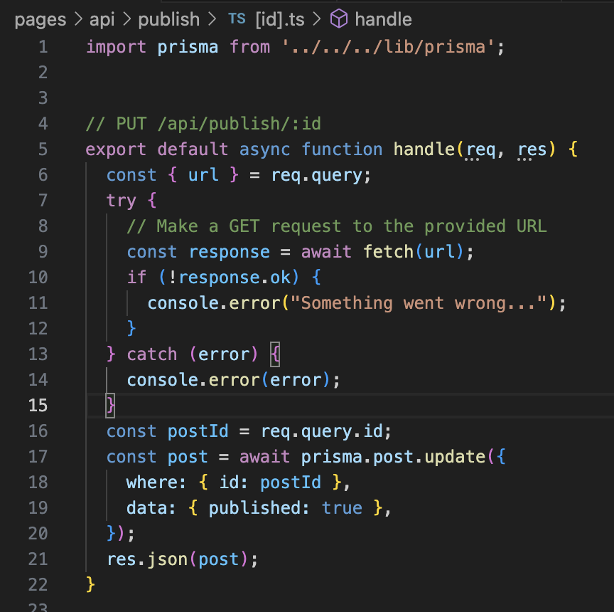
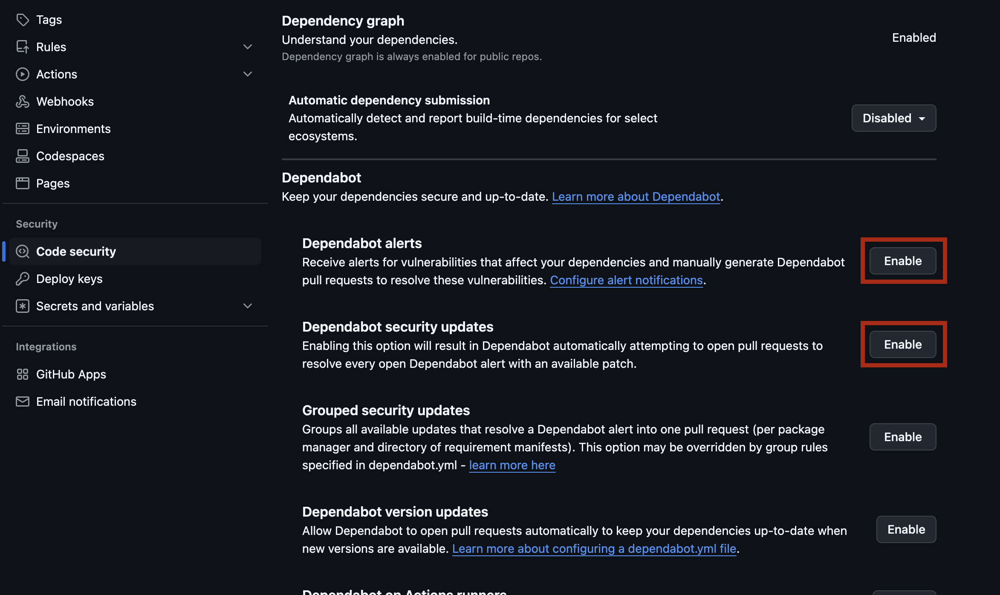
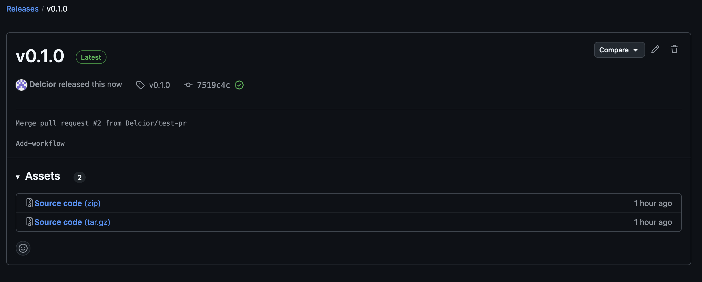

# DevOps in Action: A Hands-On Guide to Building a Modern SDLC

Welcome to the DevOps Bootcamp! This bootcamp is designed to give you hands-on experience with setting up a standard Software Development Life Cycle (SDLC) for a simple application, using GitHub, GitHub Actions, and other free-tier DevOps tools. Over the course of this 3-hour interactive session, you’ll learn how to:

* Create and manage a GitHub repository.
* Implement Continuous Integration and Continuous Delivery (CI/CD) pipelines.
* Deploy applications to free-tier service.

# 1. Requirements

## 1.1. Prerequisites

* Basic command-line skills: Comfort with navigating directories and running simple commands in a terminal.
* Git & GitHub basics: Understanding of how to clone a repository, commit changes, and push to a remote branch.

## 1.2. Materials

* A laptop.
* A GitHub account (free).
  
  During the workshop we will work on GitHub Codespaces. This ensures everyone has a uniform environment, reducing setup issues.

## 1.3. Technical Setup

Before the bootcamp starts, please ensure the following:

* GitHub Account
  
  Create a free GitHub account if you don’t already have one.

# 2. Agenda

## 2.1. High-level

Below is a high-level breakdown of the 3-hour bootcamp session:
* Introduction to DevOps and the SDLC
* GitHub Repository and Environment Setup
* Implementing CI/CD with GitHub Actions
* Deploying to a Free-Tier Service

## 2.2. Daily Schedule (3-Hour Workshop)

| Time (Approx.) | Activity                                |
| -------------- | --------------------------------------- |
| 0:00 - 0:20    | [SDLC Overview](https://bootcamp2025-pega.github.io/instructions/) |
| 0:20 - 0:30    | GitHub Repository and Environment Setup |
| 0:30 - 2:40    | Implementing CI/CD with GitHub Actions  |
| 2:40 - 3:00    | Summary & Closing Remarks               |

# 3. Steps to Follow

## 3.1. Module 1: DevOps & SDLC Overview

## 3.2. Module 2: Setting Up a GitHub Repository

1.  **Navigate to the Bootcamp Organization**

  *   Go to the [Bootcamp2025-Pega organization on GitHub](https://github.com/Bootcamp2025-Pega).
  
2.  **Navigate to the Instructions Repository**

  *   For detailed instructions, refer to the [instructions repository](https://github.com/Bootcamp2025-Pega/instructions). This is the document you are currently reading.

3.  **Navigate to the bootcamp-blog application repository**

  *  Please see [bootcamp-blog repository](https://github.com/Bootcamp2025-Pega/bootcamp-blog). This is a repository with the application we will be working on. This is an interactive UI-based application where users can post blog messages.

4. **Create your own fork of bootcamp-blog repository**

   * 1. **Click the "Fork" button:**  In the top-right corner of the repository page, click the "Fork" button.

   

   * 3. **Select the organization:** Choose your user space as an organization.
   * 4. **Rename the repository:** In the "Repository name" field, enter the name for the forked repository, following the pattern `bootcamp-blog-{username}`, replacing `{username}` with your GitHub username.

   

   * 5. **Create the fork:** Click the "Create fork" button.

5. **Navigate to your repository and get familiar with project**

  * 1. **Navigate to your forked repository:** Go to your personal fork of the `bootcamp-blog` repository (named `bootcamp-blog-{username}`) on GitHub.
  * 2. **Explore the codebase:** Familiarize yourself with the project structure, files, and code. Pay attention to the `README.md` file, which provides an overview of the application.

6. **Run application in Codespaces**

    * 1.  **Open Codespaces:** Navigate to your forked `bootcamp-blog-{username}` repository on GitHub. Click on the green "Code" button.
    * 2.  **Create new Codespace:** Select the "Codespaces" tab and click on "Create codespace on main". This will start a new cloud-based development environment.
    
    * 3.  **Wait for Codespace to initialize:** GitHub will set up a virtual machine and automatically clone your repository into it. This process may take a few minutes.
    * 4.  **Run the application:** Once the Codespace is ready, navigate to a terminal. Run commands:
    ```bash
    docker compose up -d
    npm install
    npx prisma db push
    npm run dev
    ```
    
    * 5.  **Access the application:** Once the application is running, Codespaces will provide a URL to access it. Go to the **Ports** tab in the bottom panel and find the URL next to port 3000. Click on the URL to open the application in a new browser tab.
        

## 3.3. Module 3: Implementing CI/CD with GitHub Actions

### 3.3.1. Basic build pipeline

Goal: Create basic pipeline that builds project and execute tests.

1.  **Create a base workflow**
  * make sure you are on the `main` branch<br>
  `git branch`
  * create a new one<br>
  `git checkout -b add-workflow`
  * paste the following into `/.github/workflows/ci-cd.yaml`
  ```yaml
name: CI/CD Pipeline

# Trigger the workflow on push to main and develop branches, and on pull requests
on:
    push:
      tags:
        - '*'
      branches:
        - main
    pull_request:
      branches:
        - main

# Global environment variables
env:
    NODE_VERSION: '18.x'

jobs:
    # Lint & Test Job - Runs on all triggers
    build-and-test:
      name: Build & Test
      runs-on: ubuntu-latest
  
      steps:
      - name: Checkout code
        uses: actions/checkout@v4

      - name: Set up Node.js ${{ env.NODE_VERSION }}
        uses: actions/setup-node@v3
        with:
          node-version: ${{ env.NODE_VERSION }}
          cache: 'npm'

      - name: Install Dependencies
        run: |
          npm ci

      - name: Build
        run: |
          DISABLE_DB_CONNECTION=true npm run build

  ```
  * commit changes and push to remote<br>
  `git add .`<br>
  `git commit -m "add basic workflow"`<br>
  `git push -u origin add-workflow`

  * head to the URL provided by git
  
  * you will see context menu for Pull Request creation<br>
  **IMPORTANT**: set `base` (red box) to point to **your** repo, not the BootCamp one
  

  * adjust the title / add description and click `Create pull request` button

  * you will see the pull request page. Wait few seconds for **CI/CD Pipeline** check to appear. You can view details of the pipeline run by clicking its name.
  

  * Once the pipeline will pass, merge the PR (`Merge pull request` button).
  
### 3.3.2. Execute Unit Tests

Unit tests in the project are using jest framework. If you need to run them, just call `npx jest` in terminal.
We need to execute tests in our workflow too. Locate the `steps` list in your GitHub Actions workflow file (`.github/workflows/ci-cd.yml`) and add the following step:

```yaml
      - name: Run tests with coverage
        run: npx jest
```
Create a pull request, wait for validation to pass and merge.

### 3.3.3. Static Code Analysis
#### **SonarCloud**
SonarCloud is a cloud-based service designed to continuosly inspect your cose for quality and security issues. What it does:
* Code Quality Analisys: scans code to detect bugs, code smells, and vulnerabilities
* Integration: easy integration with CI/CD pipelines, and tools like Github, Bitbucket, Azure DevOps
* Pull Request decoration: It can provide comments on pull requests with summary of its results
* Dashboard: Detailed dashboard is available

#### **Integrate SonarCloud to your project**
In order to integrate Sonar into your project follow those steps:
1. Go to SonarCould [login page](https://sonarcloud.io/login)
2. Choose login with Github

3. Grand SonarQubeCloud necessary permissions to your project

4. Configure project binding on the github side. Navigate to https://github.com/<github_username>/bootcamp-blog-<github_username>/settings/installations and ensure the **SonarQubeCloud** is configured properly: check `Repository access` section and verify that your project access is granted.
5. Generate token. In order to connect Github and Sonar you need to generate token:
* First go to My Account

4. Connect to bootcamp org

5. Click on + sign and choose Analyze new project


6. Choose "Import another organization"


7. Import from Github


8. Choose GitHub


9. Choose your **private account**


10. Choose free plan and create organization
11. Analyse new project


12. Choose your repository and set it up


13. Choose Previous version and create project


14. Generate token. In order to connect Github and Sonar you need to generate token:
  * First go to My Account


  * Go to Security tab, enter token name of your choosing, generate token


* Now you need to add token to Github secrets. Enter name and contents of your secret.


15. Configure project by providing sonar settings file.

 Create a file named `sonar-project.properties` in the root of your project with the following content:

  ```properties
  # Organization name: github username or organization, if repo is assigned to one
  sonar.organization=<github_username>
  # Project key on sonar. Default is <org_name>_<your-repo-name>
  sonar.projectKey=<github_username>_bootcamp-blog-<github_username>
  
  # Sources
  sonar.sources=.
  sonar.exclusions=**/__tests__/**/*,**/*.test.js,**/*.spec.js
  
  # Tests
  sonar.tests=.
  sonar.test.inclusions=**/__tests__/**/*,**/*.test.js,**/*.spec.js
```

16. You are all set. On your workflow run, sonar scan will be executed and published to the repository.

### 3.3.4. Test Coverage

In order to capture coverage, we need to enable it alongside tests.

Add the following content to `module.exports` in the `jest.config.js` file on the ROOT of your project:
```js
  collectCoverage: true,
  coverageDirectory: 'coverage',
  coverageReporters: ['lcov', 'text']
```
This ensures that coverage is captured.

| **lcov** format is a standard coverage format understood by sonar.

To ensure SonarCloud correctly analyzes your code coverage reports, 
update sonar-project.properties file and set the paths to `lcov` file:
  
  ```properties
  sonar.javascript.lcov.reportPaths=coverage/lcov.info
  sonar.coverage.exclusions=**/__tests__/**/*,**/*.test.js,**/*.spec.js
  ```

Verify Configuration. After your workflow completes:
  - Check your SonarCloud dashboard
  - Verify coverage metrics are displayed
  - Review the code quality and coverage insights

This integration will help you track code quality and ensure adequate test coverage for your application.

### 3.3.5. Static Application Security Testing (SAST)
1. Follow [GitHub instruction](https://docs.github.com/en/code-security/code-scanning/enabling-code-scanning/configuring-default-setup-for-code-scanning#configuring-default-setup-for-a-repository) to enable CodeQL scans on your repository.

2. Chackout to new branch
3. Add below code block to `handle(req, res)` method in [pages/api/publish/[id].ts](https://github.com/Bootcamp2025-Pega/bootcamp-blog/blob/main/pages/api/publish/%5Bid%5D.ts)
```ts
  const { url } = req.query;
  try {
    // Make a GET request to the provided URL
    const response = await fetch(url);
    if (!response.ok) {
      return res.status(400).json({ message: 'Failed to fetch from the provided URL' });
    }
  } catch (error) {
    res.status(500).json({ message: 'Internal server error' });
  }
```
  It should look like this:


4. Push changes to remote brach and create a Pull Request
5. Wait for CodeQL analysis to finish and review issue found.


### 3.3.6. Software Composition Analysis (SCA)
1. Go to Security tab in your Gtihub repository
2. Click "Enable Dependabot alerts"

3. Click "Enable" on Dependabot Alerts 

4. Go back to Security tab and review Dependabot findings 

### 3.3.7. Releasing stable version
After itegrating bunch of changes to `main`, you've finished working on a feature(s) and you need to release a new version. 
* Go to main view of your repository, on the right-side you'll see `Releases` section. Click on the link <br>

* Type tag name (e.g. v0.1.0), title and description containing changes introduced in new Release. After clicking `Publish release`, GitHub will create new tag (with name you've provided) and will trigger your workflow.<br>

* You can then view your release along with its assets


## 3.4 Module 4: Deployment to Free-Tier Service
# How to Create an Account on Vercel

This guide will walk you through the steps to create an account on Vercel.

### 1. Sign Up Options

You can sign up for a Vercel account using the following methods:
- **Email**: Use your email address to create an account.
- **Git Providers**: Sign up using GitHub, GitLab, or Bitbucket.
- **Passkeys**: Use passkeys for login, which include biometric methods or hardware security keys.

***In our case, we will focus on Signing Up with Email***

### 2. Signing Up with Email

1. Enter your email address on the [Vercel sign-up page](https://vercel.com).


2. You will receive a six-digit One-Time Password (OTP) to your email.

3. Enter the OTP to complete the sign-up process.

> **Note**: No Git provider is connected by default when using email. You will need to verify your account on every login.


---

For more details, visit the [Vercel Documentation](https://vercel.com/docs/accounts/create-an-account).


# How to Get a Vercel API Access Token

This guide explains the steps to create and manage a Vercel API Access Token.

### 1. Navigate to Account Settings

1. Log in to your Vercel account.
2. In the top-right corner of the dashboard, click on your profile picture.
3. Select **Settings** from the dropdown menu.

### 2. Access the Tokens Section

1. In the **Account Settings** page, locate the **Tokens** section in the sidebar.
2. Click on **Tokens** to open the token management page.

### 3. Create a New Access Token

1. In **Create token** section:
2. Enter a descriptive name for your token.

3. Choose the scope of access for the token:
   - Personal Account
   - Specific Teams (if applicable)
4. Set an expiration date for the token (optional but recommended for security).
5. Click **Create** to generate the token.
6. Please copy your token and store it in a safe place.
For security reasons, you are not able to see it again.

> **Important**: Make a note of the token immediately after creation, as it will not be displayed again.

### 4. Use the Access Token

This guide explains how to securely store access token, in your GitHub repository using repository secrets.

#### 4.1. Navigate to Your Repository Settings

1. Go to the main page of your GitHub repository.
2. Under your repository name, click on **Settings**.

### 4.2. Access the Secrets Section

1. In the **Settings** sidebar, locate the **Security** section.
2. Click on **Secrets and variables**, then select **Actions**.

### 4.3. Add a New Repository Secret

1. Click the **New repository secret** button.
2. In the **Name** field, enter a name for your secret: `VERCEL_TOKEN`.
3. In the **Secret** field, paste the value of your secret.
4. Click **Add secret** to save it.


# How to set up your Vercel Postgres database


This guide explains the steps to set up a Vercel Postgres database for your project.

### 1. Access the Storage Tab

1. Log in to your Vercel account.
2. Navigate to your project dashboard.
3. Select the **Storage** tab from the project settings.

### 2. Create a New Database

1. Select **Neon Serverless Postgres** from the list and click **Create**.


2. On the **Create Database** form , select `Region` and `Installation plan`.


3. Click **Continue** to proceed.

### 3. Configure the Database

1. Enter a name for your database (e.g., `my_postgres_db`).
   - The name can only contain alphanumeric characters, underscores (`_`), and hyphens (`-`).
   - It must not exceed 32 characters.
2. Click **Create** to finalize the setup.

### 4. Environment Variables

1. Once the database is created, Vercel automatically adds environment variables to your project:


  
> **Important**: We just created db but is  it not connected to any project yet.


# How to add your GitHub project to Vercel and connect to database


This guide explains the steps to connect your GitHub project with arleady created db.

### 1. Link project

1. Go to your GitHub project, open `Codespaces`.
2. Export VERCEL_TOKEN
```bash
export VERCEL_TOKEN=<past_your_vercel_token>
echo $VERCEL_TOKEN
```
3. Install Vercel cli and link your project
```bash
npm i -g vercel
vercel --version
vercel link --token=$VERCEL_TOKEN
```
Accept default values. After finishing you should see:


### 2. Add secrets to your GiHub project

1. Go to directory `.vercel` and open file `project.json`
2. Add next secrets into you GitHub project:
- `VERCEL_PROJECT_ID` - copy value from `project.json` file from key `projectId`
- `VERCEL_ORG_ID` - copy value from `project.json` file from key `orgId`

### 3. Connect project to database

1. Go to your Vercel page, go to `Storage` and click button `Connect Project`


Select proper values and click `Connect`

### 4. Export env variables

1. Back to `Codespaces` and execute command
```bash
vercel env pull .env --token=$VERCEL_TOKEN 
```
`.env` file should be generated.
We now have a fully functioning Vercel Postgres database and have all the environment variables to run it locally and on Vercel.

# Setup Prisma and create the database schema

This guide explains the steps to setup Prisma and create database schema.

### 1. Install Prisma

1. Go to `Codespaces` and execute command
```bash
npm i prisma --save-dev --legacy-peer-deps
npm i @prisma/client@6.5.0 --legacy-peer-deps
```

### 2. Generate schema

1. Prisma schema defines two models into direcotry `prisma`, each of which will map to a table in the underlying database: User and Post.
To actually create the tables in your database, you now can use the following command:
```bash
npx prisma db push
```
You should see following output:


# Creating OAuth Apps in GitHub

To create an OAuth app in GitHub, follow these steps:

### Step 1: Navigate to GitHub Settings

1. Go to GitHub and log in to your account.
2. In the upper-right corner of any page, click your profile photo, then click **Settings**.

### Step 2: Register a New OAuth Application

1. In the left sidebar, click **Developer settings**.
2. In the left sidebar, click **OAuth Apps**.
3. Click **New OAuth App**.


### Step 3: Fill in the Application Details

1. **Application name**: Enter a name for your application. This name will be displayed to users when they are asked to grant access to your application `<project name>.vercel.app`.
2. **Homepage URL**: Enter the URL of your application's homepage `https://<project name>.vercel.app`.
3. **Authorization callback URL**: Enter the URL where users will be sent after they authorize with GitHub. This URL should be a route in your application that handles the OAuth callback. `https://<project name>.vercel.app/api/auth/callback/github`


### Step 4: Register the Application

1. Click **Register application**.
2. After registering, you will be redirected to the application's page where you can see the **Client ID** and **Client Secret**. These credentials are used to authenticate your application with GitHub.

### Step 5: Configure Environment Variables

1. In your GitHub project, store the **Client ID** and **Client Secret** as secret variables:
 - NEXTAUTH_URL = `https://<project name>.vercel.app/api/auth`
 - OAUTH_SECRET =  paste e.g. `verystrongsecret`
 - OAUTH_GITHUB_ID = **Client ID**
 - OAUTH_GITHUB_SECRET = **Client Secret**
 


### 3.4.1. TODO

